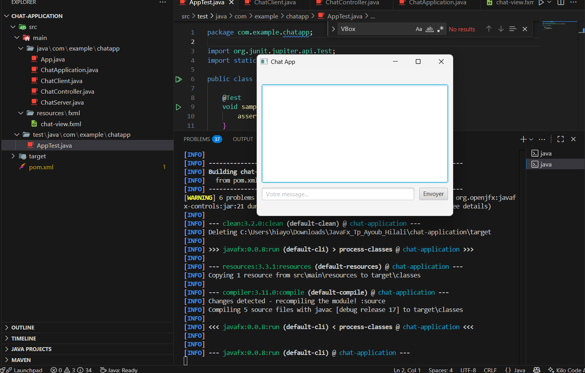

# 💬 Application de Chat avec JavaFX, Sockets et Threads

## 📌 Description
Cette application est un petit projet de **chat en temps réel** développé avec **JavaFX** pour l’interface graphique et **Java Sockets + Threads** pour la communication réseau.  
Elle permet à plusieurs clients de se connecter à un serveur et d’échanger des messages instantanément.

---

## ⚙️ Fonctionnalités
- Interface utilisateur construite avec **JavaFX + FXML**
- Gestion de plusieurs clients avec des **Threads**
- Communication via **Sockets TCP**
- Zone de texte pour afficher la conversation
- Champ de saisie et bouton *Envoyer*
- Interface stylisée avec **CSS**

---

## 📂 Structure du projet
chat-application/
│── src/main/java/com/example/chatapp/
│ ├── ChatApplication.java # Classe principale JavaFX
│ ├── ChatController.java # Contrôleur lié au FXML
│ ├── ChatServer.java # Serveur Socket multi-clients
│ └── ChatClient.java # Client Socket
│
│── src/main/resources/fxml/
│ └── chat-view.fxml # Vue JavaFX (interface graphique)
│
│── src/main/resources/css/
│ └── style.css # Feuille de style
│
│── pom.xml
└── README.md

yaml
Copier le code

---

## ▶️ Exécution du projet

### 1️⃣ Lancer le serveur
```bash
mvn exec:java -Dexec.mainClass="com.example.chatapp.ChatServer"
2️⃣ Lancer un client JavaFX
Dans un nouveau terminal :

bash
Copier le code
mvn clean javafx:run
👉 Tu peux ouvrir plusieurs fenêtres client pour tester la communication en temps réel.

## Capture d’écran

    


📖 Technologies utilisées
Java 17

JavaFX 21

Sockets & Threads

Maven

👨‍💻 Auteur
Projet réalisé par Ayoub Hilali 🎯